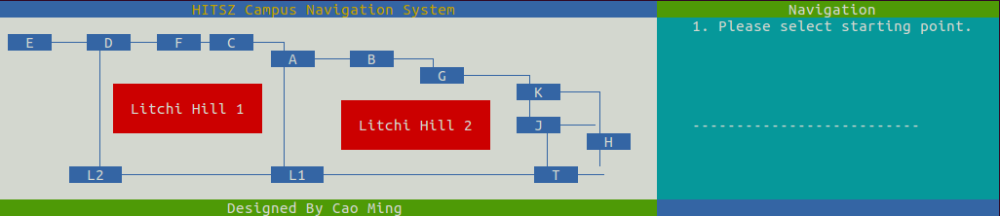
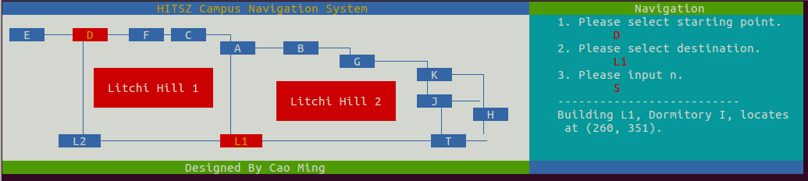
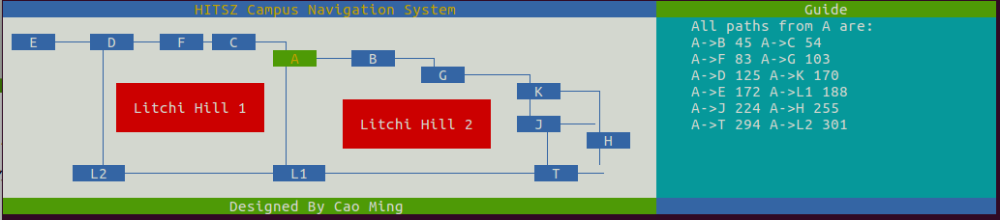

# HITSZ Navigation System

该工程为HITSZ 机电学院专业选修课《数据结构》课程大作业，其要求为

1. 设计一个所在学校的建筑和道路平面图,所含建筑不少于 10 个,并建立全局坐标,按照全局右手定则确定角度存储各建筑点的信息,包括位置坐标(二维)和简要介绍(例如:G 栋,理学楼);
2. 提供图中任意建筑点的相关信息查询,即输入关键字可输出相关信息(例如:输入 G 栋;给出结果:G 栋,理学楼,坐标(2, 3));
3. 提供图中多个建筑点的最佳访问路线查选,即求途经 n(任意)个景点的最短路径,并给出所经过的点的方位和长度。(给定开始和结束景点,并一共包含 n 个景点,从 A 栋到 G 栋,途径 A-B-C-D-F-G,在 B 点位于 A 点 30°方向并距离 A 点 5)
4. 提供任意建筑点问路查询,即查询某个建筑到其他任意一个建筑点的最短路径,并按照路径长
度从小到大的顺序排列(不能使用迪杰斯特拉算法)。

##　实现细节
本工程除了实现了报告里的内容要求外,还实现了一套基于 Linux ANSI ESC code 的 UI 系统(源文件存放在 UI 文件夹下)。ANSI ESC code 是 Unix 下的控制命令行输出颜色的程序规范,不需要任何库文件。本工程已在 Ubuntu 16.04 下测试通过。Windows 因为对 ANSI ESC code 的支持不太好,故应该需要使用 WINAPI 修改绘图的函数。但是时间来不及了就没做了。GUI 部分涉及相当多的逻辑。

整个界面是一个有限状态机,通过 CampusGraphDrawer.Spin()函数在死循环里响应键盘输入。同时每个建筑物都是一个 Button 类,每个绘制的路径都是一个 Polyline 类,每个在图中显示的话都是 text 类。相当于实现了一个 minimal 的、基于 ANSI ESC code 的类 QT 小程序(但不需要任何其他库)。第三个要求使用深度优先搜索+回溯法，第四个要求使用A*算法。

## 使用说明
wasd控制上下左右，enter 为选择，ESC为返回主菜单。
## 效果图

